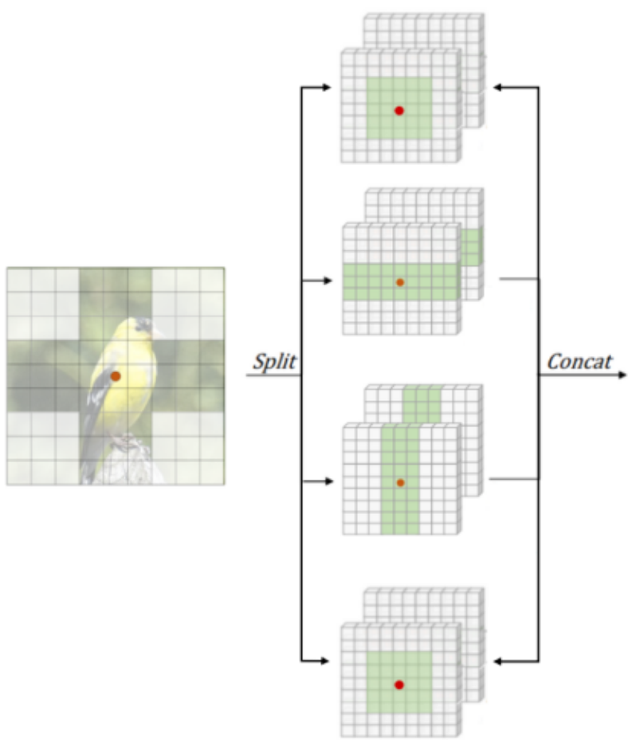

# Reimplementation and Improvement on the CSWin Transformer

## Introduction
This project introduces an alternative approach to the CSWin Transformer. The original model employs a Cross-Shaped Window self-attention mechanism and Locally Enhanced Positional Encoding (LePE). Our version enhances the multi-head attention mechanism by integrating a sliding window self attention mechanism method and increasing the number of splits, aiming to refine the attention process and boost efficiency.

## Proposed Modification

We contend that the attention of each token is influenced not only by its immediate neighbors but also by tokens further away. Thus, we introduce a Sliding Window self-attention in conjunction with Cross-Shaped Window self-attention. Our modifications are visually represented below:



### Multi-head Splitting
To enhance parallel processing efficiency, we've advanced our multi-head splitting approach by dividing the attention heads into quarters, facilitating different attention dynamics:

$$
head_k = \left\{ 
\begin{array}{ll}
LocalArea-Attention_k(X) & k > \frac{3K}{4} \\
V-Attention_k(X) & \frac{K}{2} < k \leq \frac{3K}{4} \\
H-Attention_k(X) & \frac{K}{4} < k \leq \frac{K}{2} \\
LocalArea-Attention_k(X) & k \leq \frac{K}{4}
\end{array} 
\right.
$$

This configuration allows us to use half the heads for the original Cross-Shaped Window self-attention and the other half for Sliding Window self-attention, maintaining a balance between horizontal and vertical splits. The number of heads per stage is set to blocks of 4, 8, 16, and 32, each with a base embedding dimension of 64.

### Size of Sliding Window
Observations showed that matching the Sliding Window size to the stripe width of the cross-shaped window limits token attention range. To overcome this, we've doubled the size of the sliding window, now defined as `2sw × 2sw`, allowing tokens to attend to a broader range of neighbors. This adjustment not only expands the attention range but also reduces computational costs, achieving a balance between cost and enhanced token attending capabilities.

## Instruction on Running the code
Before training the model, you need to organize your dataset correctly. Please place the ImageNet dataset into the following directory:
```
./dataset
```
Ensure that the data is structured correctly within the `./dataset` folder to be recognized by the training script.

### Training the Model
To train the model, use the following command in the terminal. Make sure you are in the project's root directory where `main.py` is located:

```bash
python main.py --data "./dataset" --model "MODEL"
```
In the command above, replace **"MODEL"** with one of the specific configurations:
- **"norm"**: for the standard model without any modifications.
- **"sw1"**: for the model with sliding window width and height same as the stripe width of the Cross-shaped Window.
- **"sw2"**: for the model with sliding window width and height 2 times larger than the stripe width of the Cross-shaped Window.

### Example
Here is an example command to train the model with the second sliding window modification (**"sw2"**):

```bash
python main.py --data "./dataset" --model "sw2"
```


## Experiment
We tested our modifications using the ImageNet-100 dataset, a subset of the larger ImageNet-1K dataset. Both the original CSWin-T and our modified CSWin-T-sw2 models were compared under identical training conditions.

Both models were trained for only 150 epochs with 3 × 224 × 224 inputs while the warm-up epochs at 20. The batch size for both models was fixed at 128 batch size. We used the Cosine Annealing Learning Rate Scheduler with the learning rate as 2 × e−3. The weight decay was set as default in 0.5 while the modelema-decay was also set as default 0.99984. The experiments were conducted on a system equipped with 12 vCPU Intel(R) Xeon(R) Platinum 8352V CPU @ 2.10GHz, an RTX 4090 GPU with 24GB memory, and 90GB RAM. The software environment consisted of Python 3.8 and CUDA 11.8.

## Results
| Model         | Sliding Window size | Param # | Val. Loss | Top 1 | Top 5 |
|---------------|---------------------|---------|-----------|-------|-------|
| CSWin-T       | -                   | 23M     | 0.75      | 84.72 | 96.40 |
| CSWin-T-sw1   | sw                  | 21.13M  | 0.74      | 84.74 | 96.31 |
| **CSWin-T-sw2** | **2×sw**            | **21.13M** | **0.71**  | **85.47** | **96.46** |

*Table: Comparison of stripe width multiplication 1 and 2 on ImageNet100 dataset.*

The CSWin-T-sw2 model significantly outperforms the original CSWin-T architecture. It achieves a Top-1 accuracy of **85.47%**, surpassing the CSWin-T model, which records **84.72%**. This translates to a notable accuracy increase of **+0.75%**. CSWin-T-sw2 also shows a difference of **-0.05** compared to its counterpart. The increase in accuracy is attributed to the implementation of the local attention window in the CSWin-T-sw2 model, which is more effective in capturing the relationship between neighboring tokens compared to the original model's span across horizontal or vertical stripes.

Additionally, the CSWin-T-sw2 model has a leaner architecture with **1.87M** fewer parameters than CSWin-T, leading to reduced training times without compromising on model efficacy. The strategic design of the local attention window not only contributes to the model's accuracy but also enhances its overall efficiency.

